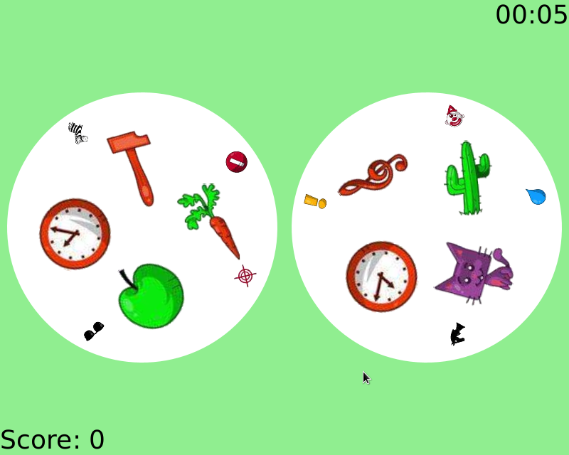

<br />
<p align="center">
  <a href="https://github.com/othneildrew/Best-README-Template">
    
  </a>

  <h3 align="center">Best-README-Template</h3>

</p>

## About The Project

Dobble is a game in which players have to find symbols in common between two cards. Application has single-player and multiplayer mode.

Applications requires Java 11.



### Built With

* [JavaFX](https://openjfx.io/)
* [Spring Boot](https://spring.io/projects/spring-boot)

### Run

1. Make sure you're using java 11
   ```sh
   java -version
   ```
2. Clone the repo
   ```sh
   git clone https://github.com/Regis111/dobble.git
   ```
3. Run server 
   ```sh
   cd server/
   ./gradlew run
   ```
4. Run client 
   ```sh
   cd client/
   ./gradlew run
   ```
